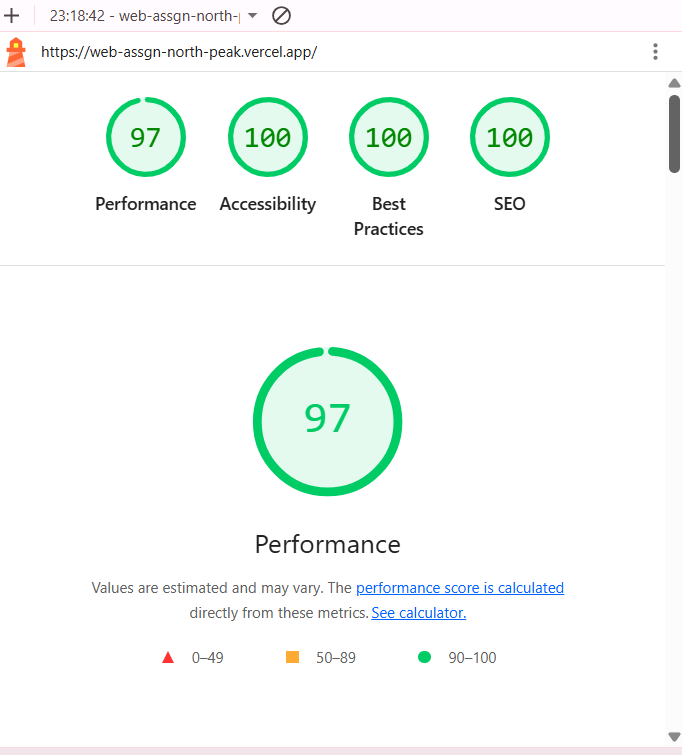
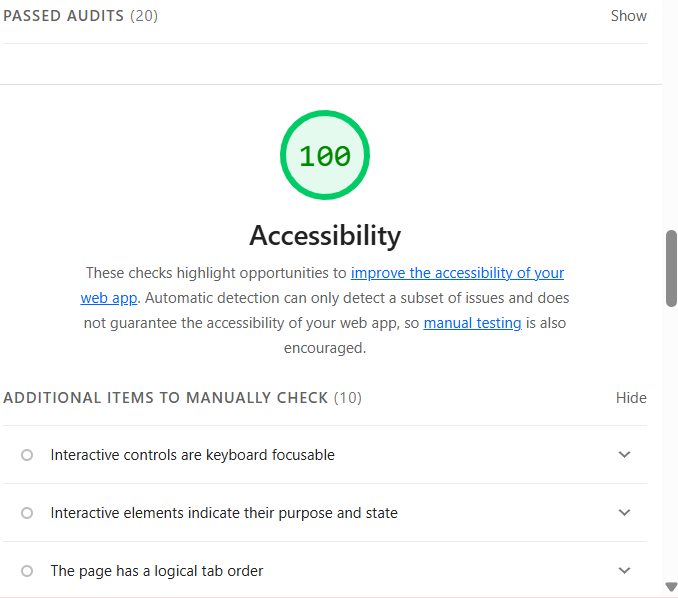

## Live Demo

https://web-assgn-north-peak.vercel.app/

## GitHub Repository

https://github.com/GeneralFloofypaws/Web_Assgn_NorthPeak

# NorthPeak Digital

A fictional digital product studio built for the Digital Heroes Frontend Internship Qualification Task.

**Live Site:** https://web-assgn-north-peak.vercel.app/

---

## Tech Stack

- React
- Vite
- CSS3
- Vercel
- GitHub

---

## Lighthouse Results

| Category | Score |
|----------|------:|
| Performance | 95 |
| Accessibility | 100 |
| Best Practices | 100 |
| SEO | 100 |

### Screenshots





---

## Optimization Changelog

### 1. SEO Improvements

- Added a descriptive page title.
- Added a meta description.
- Updated favicon and browser theme color.

**Result**

Improved discoverability and achieved a perfect SEO Lighthouse score.

---

### 2. Accessibility

- Used semantic HTML structure.
- Added meaningful alt text to images.
- Ensured buttons and links were descriptive.

**Result**

Accessibility score improved to **100**.

---

### 3. Responsive Design

- Added responsive media queries.
- Fixed overflow issues in the vertical scrolling cards.
- Adjusted typography and spacing for smaller screens.

**Result**

Consistent experience across desktop, tablet and mobile devices.

---

### 4. Performance

- Optimized image assets.
- Kept the component structure lightweight.
- Built and deployed a production build using Vercel.

**Result**

Performance reached **95**.

---

### 5. Deployment

- Connected GitHub repository to Vercel.
- Enabled automatic deployments on every GitHub push.

**Result**

Each commit automatically builds and publishes the latest version.

---

## AI Usage

AI was used as a development assistant for brainstorming real-world bussiness-like language and wording to emulate a real-world digital company (North Peak), and for thorough debugging purposes. All implementation decisions, testing etc. were completed manually. 

---

## Loom Walkthrough

Loom Link:
```

(Paste the Loom URL here.)

```
